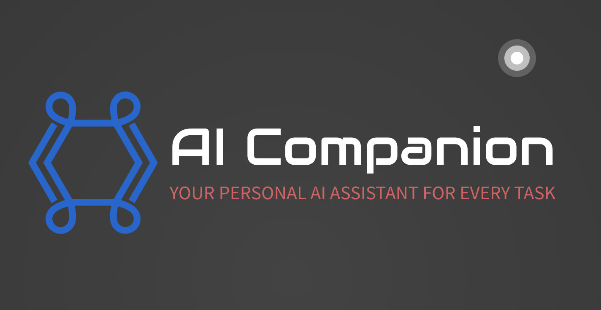

# AI Companion

AI Companion is a comprehensive service designed to be your one-stop shop for all AI needs. This service currently offers capabilities such as resume generation and audio transcription from uploaded videos. With continuous updates, AI Companion aims to become a vast library of AI tools and functionalities.

## Features

- **Resume Generation**: Automatically generate professional resumes based on user input.
- **Audio Transcription**: Convert audio from uploaded videos to text accurately and efficiently.

More features are planned for future updates. We welcome any suggestions for additional functionalities that could enhance the service.

## Getting Started

### Prerequisites

Make sure you have the following installed:

- Node.js - version 22.2.0
- npm

You will need to get an OPEN AI API Key:
 - Follow step 2 in the Quick Start guide of the OpenAI Api Docs: https://platform.openai.com/docs/quickstart

### Installation

1. Clone the repository:
    ```sh
    git clone https://github.com/yourusername/aicompanion.git
    cd AIcompanion
    ```

2. Install the dependencies for the client side:
    ```sh
    npm install
    ```

3. Install the dependencies for the server side:
    ```sh
    cd server
    npm install
    ```

4. Install FFmpeg:
    ```sh
    npm install fluent-ffmpeg
    ```

5. Update the `.env` file to include your OpenAI API key and DB name:
    ```sh
    OPENAI_API_KEY=your_openai_api_key_here
    DB_NAME=AiCompanionResume
    ```

6. Start docker container for DB
    ```sh
    docker-compose up -d
    ```

### Running the Service

1. Start the service with npm:
    ```sh
    npm run start
    ```

2. You must have the express server started to handle api calls. you can start the service directly with Node.js:
    ```sh
    npm run server
    ```

## Contributing

We are open to contributions and ideas on how to improve the AI Companion. Feel free to fork the repository, make your changes, and submit a pull request. If you have any suggestions for new features, please open an issue to discuss.

## License

This project is licensed under the MIT License. See the [LICENSE](LICENSE) file for details.

---

Feel free to reach out if you have any questions or need further assistance. Happy coding!

---

**Contact**

- **Email**: brian.stern2511@gmail.com
- **GitHub**: https://github.com/sterno2510
